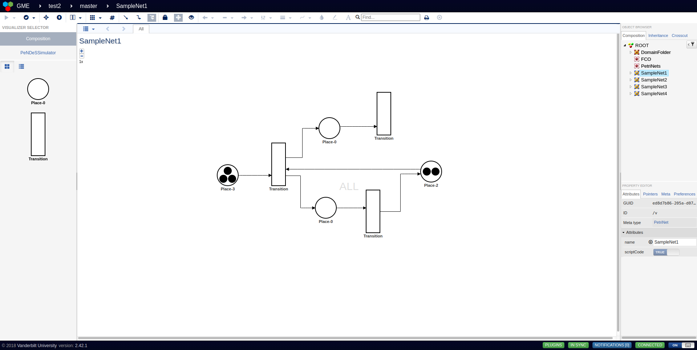
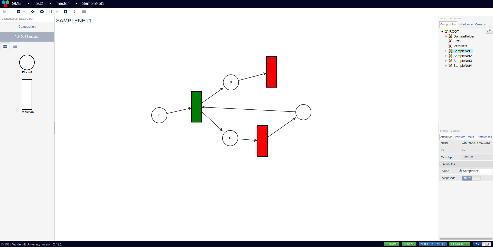
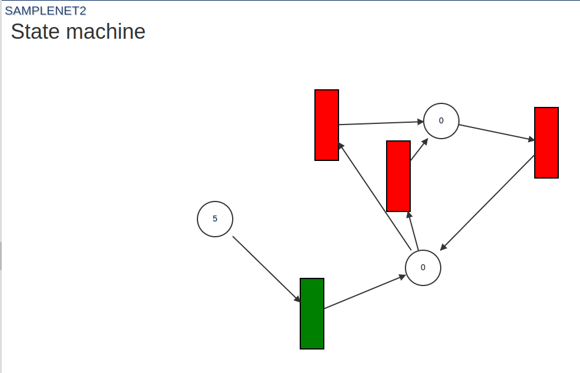

## This project will be deleted soon!

Due to GitHub's unfortunate new practice of using repositories to train Microsoft LLMs, I have made the difficult decision to migrate all of my projects to [Codeberg](https://codeberg.org/).

Because of this project's low visibility, I have decided that it is not important enough to keep on GitHub.
**Therefore, I have decided to delete this project at some point during the month of September.**
[This project's new home can be found here.](https://codeberg.org/computablee/PeNDeS)

# Petri Net Design Studio (PeNDeS)

The Petri Net Design Studio (PeNDeS) is a tool for the design and analysis of Petri nets. It is based on the WebGME framework and is available as a web application. Wikipedia explains a Petri net better than I can:

"A Petri net [...] is one of several mathematical modeling languages for the description of distributed systems. It is a class of discrete event dynamic system. A Petri net is a directed bipartite graph that has two types of elements, places and transitions. Place elements are depicted as white circles and transition elements are depicted as rectangles. A place can contain any number of tokens, depicted as black circles. A transition is enabled if all places connected to it as inputs contain at least one token." - [Wikipedia](https://en.wikipedia.org/wiki/Petri_net)

PeNDeS was designed as the term project for Model-Integrated Computing (CS-6388) at Vanderbilt University. This project was completed by Phillip Lane.



## Installation

First, you will need to clone the repository. You can do this by running the following command:

```bash
git clone https://github.com/computablee/PeNDeS.git
```

Then, `cd` into the PeNDeS directory and run the following command:

```bash
echo "BASE_DIR = $(pwd)" > .env
```

PeNDeS is shipped as a Docker-Compose file. To install PeNDeS, you must have Docker and Docker Compose installed on your system. Once you have Docker and Docker Compose installed, you can run the following command to build PeNDeS:

```bash
docker-compose build
```

This will build PeNDeS as a Docker image. This process may take a few minutes. To run PenDeS once it has been built, you can run the following command:

```bash
docker-compose up -d
```

This will launch the PeNDeS web application on port 8888. You can access PeNDeS by navigating to `http://localhost:8888` in your web browser.

To stop PeNDeS, you can run the following command:

```bash
docker-compose stop
```

## Usage

Once the WebGME UI is pulled up, a prompt will appear asking you to create a project. Click "Create New" at the bottom-left corner of the prompt and name your project. When the prompt appears for you to select a seed, select the "PeNDeS" seed. This will create a new PeNDeS project.

You will be able to see the top-level composition of the project. Items in grey should not be touched or renamed, as that will affect the metamodel. You will see four sample Petri nets. We'll get back to those later.

### Creating a Petri Net

To create a new Petri net, drag the "PetriNet" node from the left sidebar into the composition. This will create a new Petri net. You can rename the Petri net by double-clicking on the name of the Petri net and typing in a new name.

If you double click on the Petri net, you will be brought into the model editor. From there, you can drag places and transitions from the left sidebar onto the canvas. You can connect places and transitions by dragging a connection from one to the other. You can also delete places and transitions by first clicking on the item, then clicking the "X" that appears in the top-right corner of the item.

To change the marking of a place, click on the place, then find the "Marking" field in the right sidebar. You can change the marking by typing in a new value. The decoration of the place will visually indicate the marking.

### The Simulator and Interpreter

PeNDeS ships with a simulator to execute Petri nets! To use the simulator, click on the "PeNDeSSimulator" button in the left sidebar. This will open the simulator with the current Petri net. The simulator looks a little visually different than the editor, but the basic layout of your network will be reflected. **Due to a bug, you should be in the composition editor before switching networks in the right sidebar. If you are in the simulator, both the old net and new net will appear.** 

Enabled transitions are shown as green rectangles, and disabled transitions are shown as red rectangles. You can click an enabled transition to fire it. If there are no legal transitions to fire, the simulator will display a message saying so.



To reset the simulator, click the up-facing arrow icon on the top panel. This will reset the simulator to the initial state of the Petri net as specified in the composition. To classify a network, click the keyboard icon on the top panel. This will classify the network as a

* Free-choice net
* State machine
* Marked graph
* Workflow net
* "Not a particularly interesting net"



## Example Networks

In each project created from the PeNDeS seed, there are four example networks. These are safe to delete and modify, and are there to provide an easy way to get started with PeNDeS. The networks are:

* A free-choice net (SampleNet1)
* A state machine (SampleNet2)
* A net that labels as both a marked graph and a free-choice net (SampleNet3)
* A workflow net (SampleNet4)
